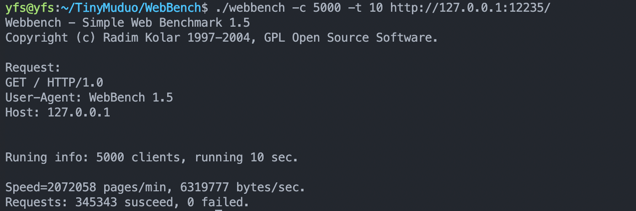

# TinyMuduo
仿照muduo实现的基于非阻塞IO和事件驱动的Reactor模式网络库.

## 1.简介

+ 使用Modern C++(C++ 17)编写,包括一些muduo中使用boost的实现，取而代之使用Modern C++中的新标准，比如std::function等。
+ 使用gtest编写单元测试代码。
+ 采用one loop per thread + 线程池的多线程模型。
+ 实现了非阻塞IO + 水平触发EPOLL的Reactor模式，其中使用基于eventfd的技术唤醒正在休眠中的EPOLLER，实现Buffer来处理非阻塞IO的读写问题。
+ 实现了stream风格的异步日志系统。
+ 基于此库实现了基础的http服务器，并且使用webbench进行了压力测试。

## 2.安装与构建

### 生成库文件

首先处于当前工程的目录之下。
```shell
$ ./build.sh
$ sudo make
```
其中库文件处于`TinyMuduo/build/src`文件夹之下，即`libtinymuduo.a`，其中目录下文件如下：
```shell
$ ls
buffer_test   CMakeFiles           eventloop_test  log_test         Makefile     socket_test  timerqueue_test
channel_test  cmake_install.cmake  libtinymuduo.a  loopthread_test  server_test  thread_test  time_test
```
### 编译生成http服务器
按照上面的编译方式也会生成http服务器可执行程序。在build目录下的example文件夹之下，即`httpserver`。

运行示例如下，指定其中的子线程数为4：
```shell
$ sudo ./httpserver 4
```
效果如下:

## 3.编程示例
更多可见src/test中的server_test.cc中关于EchoServer的实现。
## 4.压测

这里基于Webbench对httpserver做了一下简单的压力测试。
```shell
$ ./webbench -c 5000 -t 10 http://127.0.0.1:12235/
```
其结果如下：

